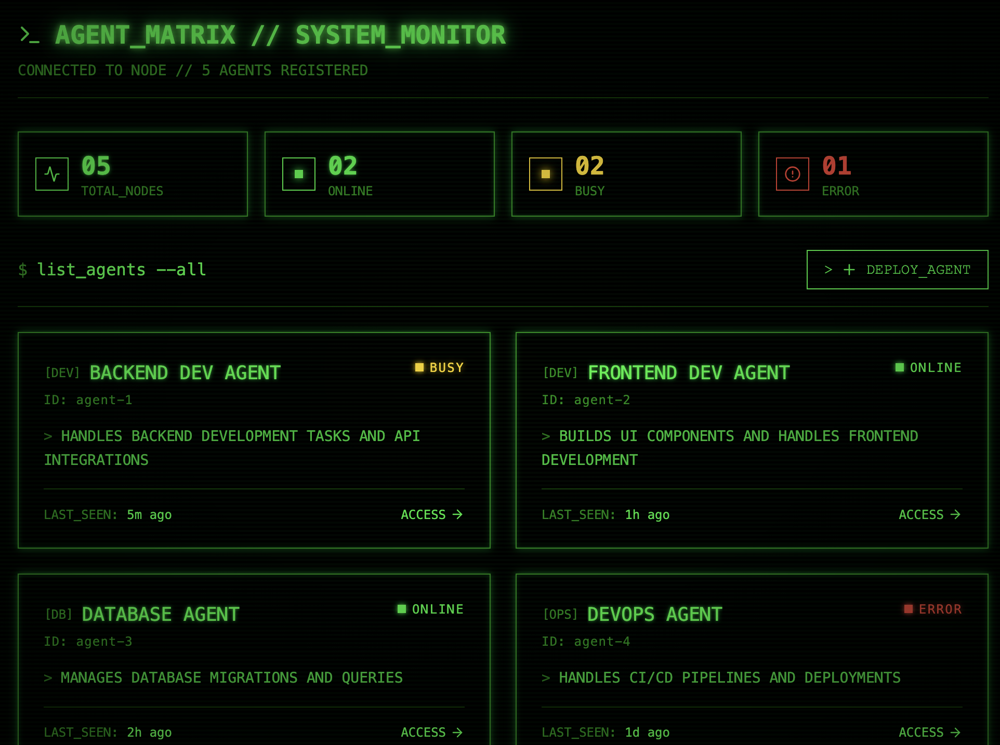

# Agent Command Center



A local dashboard for managing OpenClaw agents. Frontend dashboard (Vite + React) with a local backend API (Express + TypeScript) for reading OpenClaw agent data.


## Prerequisites

- [Node.js](https://nodejs.org/) (v18 or later recommended)
- [npm](https://www.npmjs.com/)

## Backend API

The backend server reads agents from:

```bash
~/.openclaw/agents/
```

### Endpoints

- `GET /api/agents` — list all agents
- `GET /api/agents/:id` — fetch a single agent
- `GET /health` — simple health check

### Backend behavior

- Reads each agent directory under `~/.openclaw/agents/`
- Loads metadata from `identity.json` when present
- Parses `sessions/*.jsonl` (latest session file) for status and last activity
- Enables CORS for `http://localhost:5173`
- Runs on port `3001` by default

## Setup

From repo root:

```bash
npm install
```

## Run (development)

Frontend:

```bash
npm run dev
```

Backend:

```bash
npm run backend:dev
```

Frontend will be available at http://localhost:5173  
Backend will be available at http://localhost:3001

## Build backend

```bash
npm run backend:build
npm run backend:start
```

## Notes

If `~/.openclaw/agents/` does not exist or is unreadable, API requests will return an error response.
